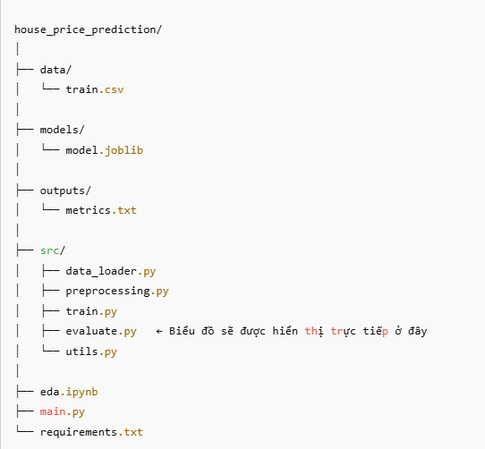

# 🏡 House Price Prediction

Dự án học máy dự đoán giá nhà sử dụng mô hình Random Forest Regressor. Dữ liệu đầu vào là tập `train.csv` từ cuộc thi [Kaggle: House Prices - Advanced Regression Techniques](https://www.kaggle.com/c/house-prices-advanced-regression-techniques).

## 📁 Cấu trúc thư mục




## 🧠 Mô tả pipeline

1. Đọc và làm sạch dữ liệu (`data_loader.py`)
2. Tiền xử lý: điền khuyết, scale số, mã hóa one-hot (`preprocessing.py`)
3. Train mô hình RandomForest + GridSearchCV (`train.py`)
4. Đánh giá hiệu suất + hiển thị biểu đồ dự đoán (`evaluate.py`)
5. Lưu mô hình và chỉ số đánh giá (`utils.py`)

## ✅ Cài đặt

### Bước 1: Tạo và kích hoạt môi trường ảo (tuỳ chọn)

```bash
python -m venv venv
source venv/bin/activate      # macOS/Linux
venv\\Scripts\\activate       # Windows
Bước 2: Cài đặt thư viện cần thiết
bash
Luôn hiển thị chi tiết

Sao chép
pip install -r requirements.txt
🚀 Chạy chương trình

✅ Cách 1: Chạy toàn bộ pipeline
bash
python main.py
Kết quả:

In ra Best Parameters, MSE, R²

Hiển thị biểu đồ giá trị dự đoán vs giá trị thực

Lưu mô hình vào models/model.joblib

Ghi đánh giá vào outputs/metrics.txt

✅ Cách 2: Phân tích dữ liệu (EDA)
bash
jupyter notebook
Mở file eda.ipynb để khám phá dữ liệu.

📊 Visualization
Chương trình sẽ hiển thị biểu đồ đường:

Trục X: index các mẫu (đã sắp xếp theo SalePrice)

Trục Y: giá trị thực tế và giá trị dự đoán

📦 Yêu cầu hệ thống
Python >= 3.7

Các thư viện trong requirements.txt

📌 Ghi chú
Đảm bảo file train.csv nằm trong thư mục data/

Có thể mở rộng dự án để hỗ trợ dự đoán dữ liệu mới bằng file predict.py

Có thể đóng gói bằng Streamlit nếu muốn giao diện

📧 Liên hệ
Tác giả: Nhóm 13
Liên hệ: https://github.com/quyendzvaio